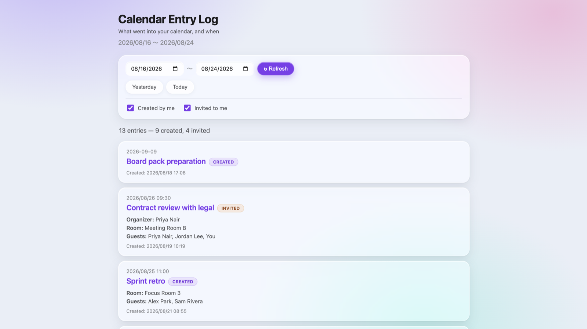
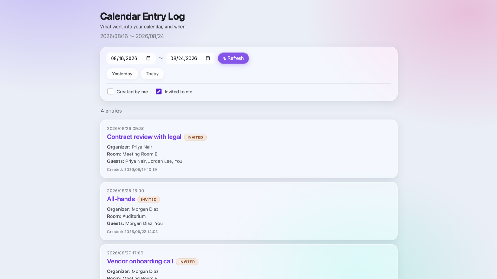
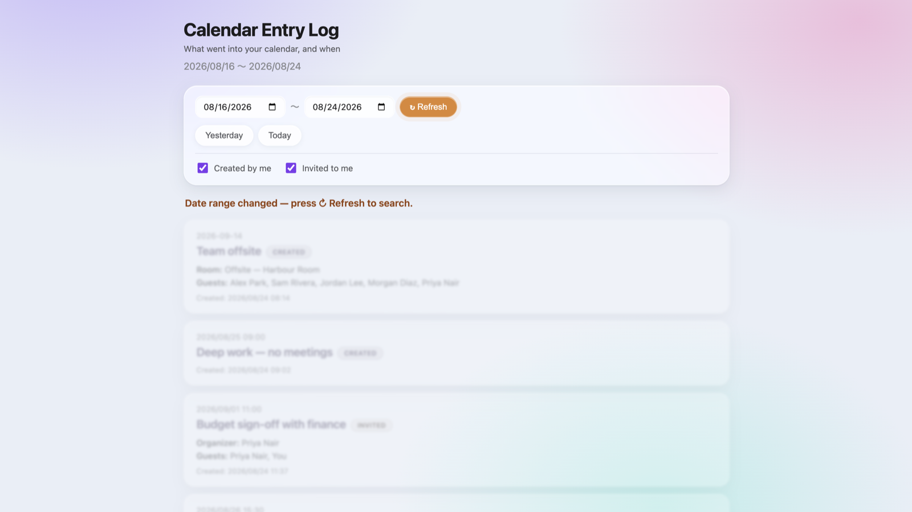

# Calendar Entry Log

A small Google Apps Script web app that answers a question Google
Calendar itself does not: **"what did I put in the calendar during this
period?"**

Calendar UIs organise events by *when they happen*. This one organises
them by *when they were entered*, and splits them by your role:

- **Created by me** — you set the entry up
- **Invited to me** — someone else set it up and put you on the guest list

Pick a date range, tick either role or both, and you get every matching
entry in creation order, with its room/resource, guest list, organiser
and creation timestamp.

It is useful if you book things on other people's behalf, need to check
at the end of the day that everything you entered actually landed, or
want a record of what was scheduled during a given week.

## Try it

**[Live demo](https://takahirogitlab.github.io/gcal-entry-log/)** — runs on
sample data, so it needs no Google account and reads nobody's calendar.
The date range and the role checkboxes behave exactly as they do against
a real calendar.

## Walkthrough

Forty seconds through the whole thing: the presets, a custom range, the
role checkboxes, and what happens when the dates stop matching the
results.

<video src="https://github.com/user-attachments/assets/cf075376-4613-4162-85ed-f7f73a6e7800" controls></video>

(If the player does not appear, your renderer is not GitHub —
[watch it here](https://github.com/user-attachments/assets/cf075376-4613-4162-85ed-f7f73a6e7800).)

## Screenshots

Pick a range and get everything entered inside it, oldest first, with a
count broken down by role.



Untick a role to narrow it. Entries someone else set up also name the
organiser.



Change a date without refreshing and the list frosts over and stops
taking clicks, so results from the previous range cannot be misread as
current.



## Setup

You need [clasp](https://github.com/google/clasp) and a Google account.

**First, turn on the Apps Script API** for your account, once, at
[script.google.com/home/usersettings](https://script.google.com/home/usersettings).
Without it every `clasp` command fails with *"User has not enabled the
Apps Script API"*.

```bash
git clone https://github.com/TakahiroGitLab/gcal-entry-log.git
cd gcal-entry-log
```

Create an empty standalone project at
[script.google.com](https://script.google.com), open **Project Settings**
and copy its **Script ID**. Then point clasp at it:

```bash
cp .clasp.json.example .clasp.json
# paste the Script ID into .clasp.json

clasp push -f
clasp create-deployment -d "v1"
```

`.clasp.json` is gitignored, so your script id stays out of the repo.

> Creating the project with `clasp create-script --rootDir src` also
> works, but clasp writes its own `appsscript.json` into the root
> directory, which would overwrite the manifest in `src/` that carries
> the Calendar service and the web app settings. If you go that route,
> restore it with `git checkout src/appsscript.json` before pushing.

Open the deployment URL. The first visit asks you to authorise Calendar
access.

### Settings that matter

`src/appsscript.json` ships with:

```json
"webapp": {
  "executeAs": "USER_ACCESSING",
  "access": "DOMAIN"
}
```

- **`executeAs: USER_ACCESSING` — do not change this.** The script runs
  as whoever opens it and reads *their* calendar. Switching to
  `USER_DEPLOYING` makes the app serve **your** calendar to every
  visitor.
- `access: DOMAIN` limits it to your Google Workspace. Use `MYSELF` for
  a personal Google account, which has no domain.

`timeZone` is `Asia/Tokyo`. Change it to yours — day boundaries are
computed in the script's timezone.

### Theme

The palette lives in one block at the top of the `:root` rule in
`src/index.html`:

```css
--accent-rgb: 124 58 237;   /* primary: buttons, links, focus, "Created" */
--accent-deep: #6d28d9;     /* readable text on the light accent tint */

--warn-rgb: 217 119 6;      /* "Invited" badge, stale-results warning */
--warn-deep: #92400e;

--blob-1: rgba(167, 139, 250, 0.55);   /* the backdrop the glass blurs */
--blob-2: rgba(244, 114, 182, 0.40);
--blob-3: rgba(94, 234, 212, 0.38);
```

The RGB triplets are consumed as `rgb(var(--accent-rgb) / <alpha>)`, so
tints, borders, focus rings and shadows all follow from those two
numbers. Keep the blobs light and low-alpha — they are what stops the
glass reading as flat grey.

### Optional motto

`src/index.html` has a commented-out `.motto` block that renders a quote
in the top-right corner. Uncomment and edit it, or leave it out.

## How it works

`getEntriesInRange(start, end)` pages through `Calendar.Events.list`
with `updatedMin` set to the start of the range, then keeps entries
whose `created` timestamp falls inside it.

`roleOf()` classifies each entry. The two roles are **mutually
exclusive** — an entry you created but also attend counts as *created*
only — so ticking both boxes lists everything exactly once.

The client fetches both roles at once and caches them against the range
they were fetched for. Toggling a checkbox re-filters that cache
instead of searching the calendar again; only Refresh, a preset, or a
toggle on a range that no longer matches goes back to the server. Edit
a date without refreshing and the list frosts over and stops accepting
clicks, so stale results cannot be misread as current.

## Known limitations

These are worth understanding before relying on it.

- **Long ranges get slow.** The Calendar API cannot query by creation
  time, so the script fetches everything updated since the start of the
  range and filters locally. The further back the start date, the more
  it pulls. Apps Script caps a single execution at 6 minutes; ranges of
  several months may hit that.
- **"Invited to me" is dated by the entry's creation, not by when you
  were added.** The API does not expose when an attendee joined. If an
  entry was created on the 1st and you were added on the 14th, a range
  covering the 14th will not show it.
- **Declined invitations still appear.** They remain on your calendar.
- **Deleted entries do not appear** (`showDeleted: false`).
- **Resource detection is a heuristic.** An attendee counts as a room if
  `resource === true` or its address contains `resource`. Unusual
  resource naming may land in the guest list instead.
- **A start date older than the calendar is rejected.** The API refuses
  an `updatedMin` from before the calendar existed rather than returning
  nothing, so the page reports that the range reaches too far back
  instead of showing an empty list.

## License

MIT — see [LICENSE](LICENSE).
